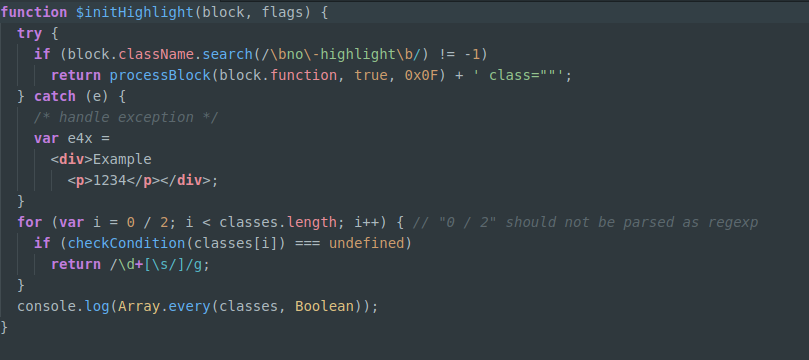

## A Dark Creek Syntax theme

A fork of One Dark, with the original dim syntax based off version 0.5.0.

There is also a matching [UI theme](https://atom.io/themes/one-dark-ui).

### Install

This theme is installed by default with Atom and can be activated by going to the __Settings > Themes__ section and selecting it from the __Syntax Themes__ drop-down menu.
